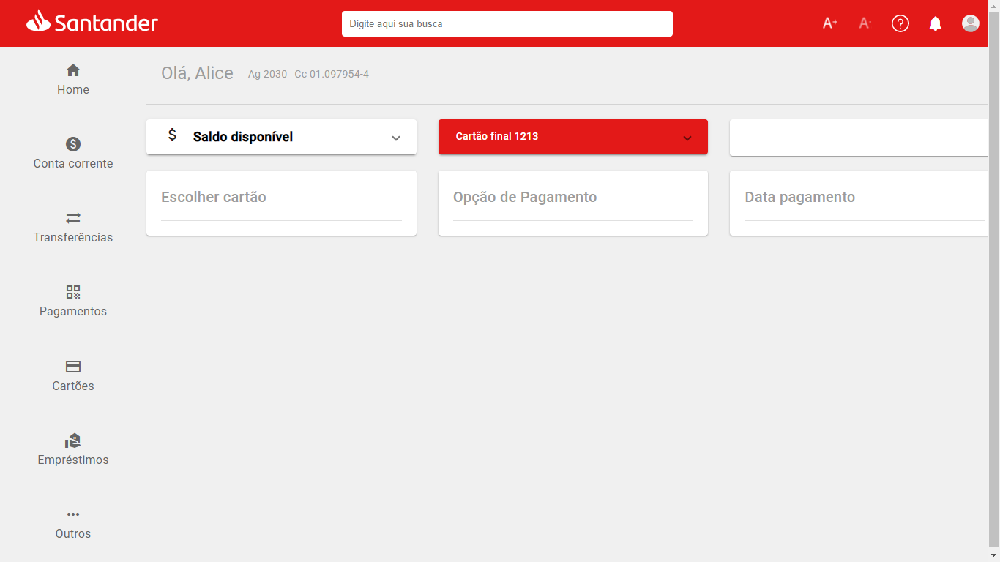

# SantanderWeb

Este projeto é baseado no Figma da Dev Week Mobile Santander através da plataforma da DIO, disponível [aqui](https://www.figma.com/file/0ZsjwjsYlYd3timxqMWlbj/SANTANDER---Projeto-Web%2FMobile?type=design&node-id=2-92&mode=design&t=Ds3mrGBtUKPbN7Rq-0);

Com a versão para desktops:

E versão para dispositivos móveis:

---

## Servidor de desenvolvimento

Use o comando `ng serve` para rodar o servidor de desenvolvimento. Navege em `http://localhost:4200/`. A aplicação fará o recarregamento automaticamente se você alterar qualquer um dos arquivos da pasta source.

---

## Ajuda sobre Angular

Para conseguir mais ajuda sobre o Angular CLI use `ng help` ou confira a página [Angular CLI Overview and Command Reference](https://angular.io/cli).
